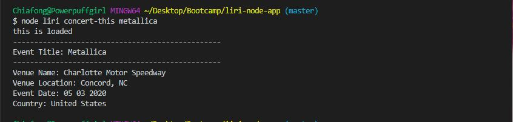
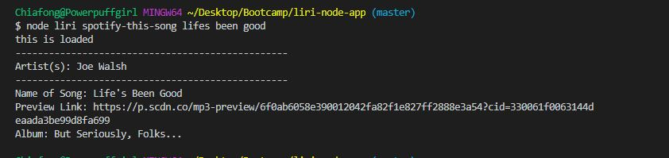
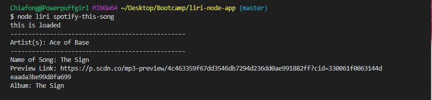
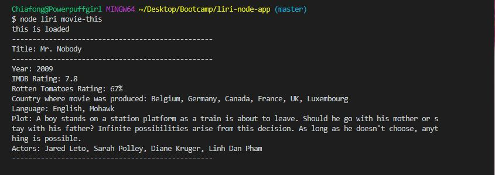
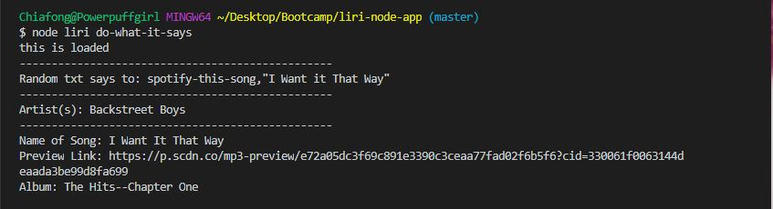

# liri-node-app

**Overview**

LIRI is a Language Interpretation and Recognition Interface. This is a command line node app that will return data based on the parameters given.

**MVP**

LIRI will search for parameters given in the command line and return data using the following APIs:

* Spotify for songs
* Bands in Town for concerts
* OMDB for movies

**Parameters**
* node liri.js concert-this <artist/band name> returns:
    - Name of the venue
    - Venu location
    - Date of the event (formated using moment as MM/DD/YYYY)

* node liris.js spotify-this-song '<song name>' returns:
    - Artist(s)
    - Song's name
    - Preview link of the song from Spotify
    - Album of the song
    - If song name is not specified, program will default to "The Sign" by Ace of Base

* node liri.js movie-this '<movie name>' returns:
    - Title of the movie
    - Year the movie came out
    - IMDB Rating
    - Rotten Tomatoes Rating
    - Country where the movie was produced
    - Language of the movie
    - Plot of the movie
    - Actors in the movie
    - If movie is not specified, the program will output data for the movie 'Mr. Nobody'

* node liri.js do-what-it-says:
    - LIRI will take the text inside of random.txt using fs Node package to call one of LIRI's commands
    - Default text in random.txt is: "spotify-this-song, "I Want it That Way"

**Examples**

*Screenshot of concert-this with band name:*

*Screenshot of concert-this without band name:*

*Screenshot of spotify-this-song with title of song:*

*Screenshot of spotify-this-song without title of song:*

*Screenshot of movie-this with title:*

*Screenshot of movie-this without title:*

*Screenshot of do-what is says:*

*Screenshot of do-what is says after modifying random.txt:*

**How to run the app:**

1. Clone a copy to your local drive.
1. Make sure you have all the npm packages installed; enter the following in your terminal to update package.json:

    npm install
1. Sign up for Spotify API keys; create a file named .env and add your Spotify keys in that file. (You need to supply your own Spotify API key)

    Example:

        Spotify API keys

        SPOTIFY_ID=your-spotify-id
        SPOTIFY_SECRET=your-spotify-secret
1. In your terminal, type in the commands in the Parameters or Example sections above to test it out.
1. Have fun!!!

**Link to Github:**

[LIRI-Bot](https://github.com/cftgithub/liri-node-app)
  
**Technologies Used**

* Javascript
* Node.js
* Axios NPM
* Moment NPM
* DotEnv NPM
* fs/File-System
* Bands in Town API
* OMDB API
* Node-Spotify-API